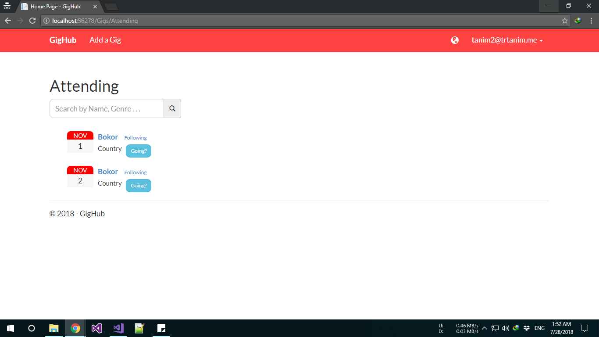
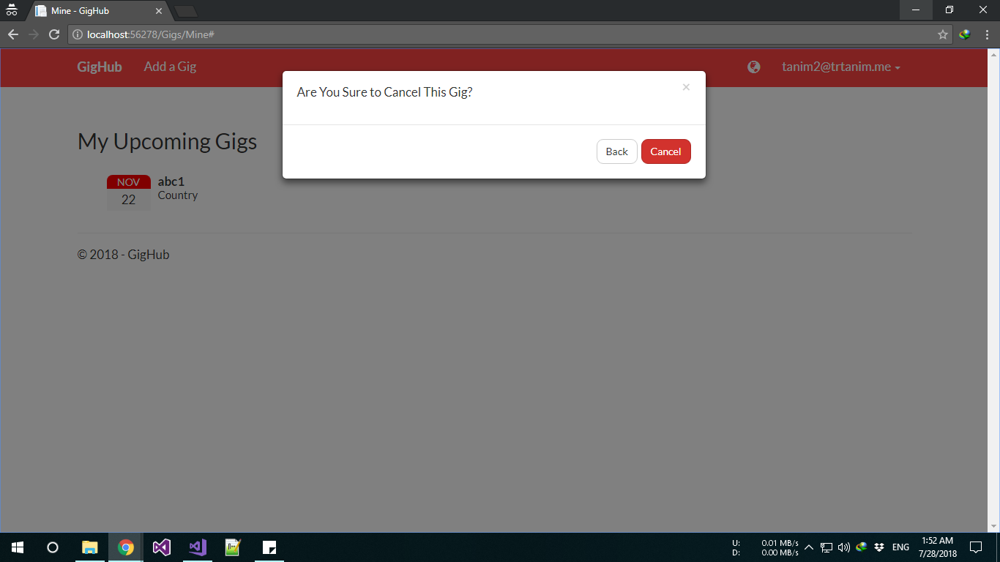
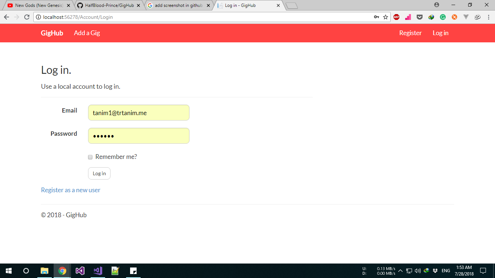
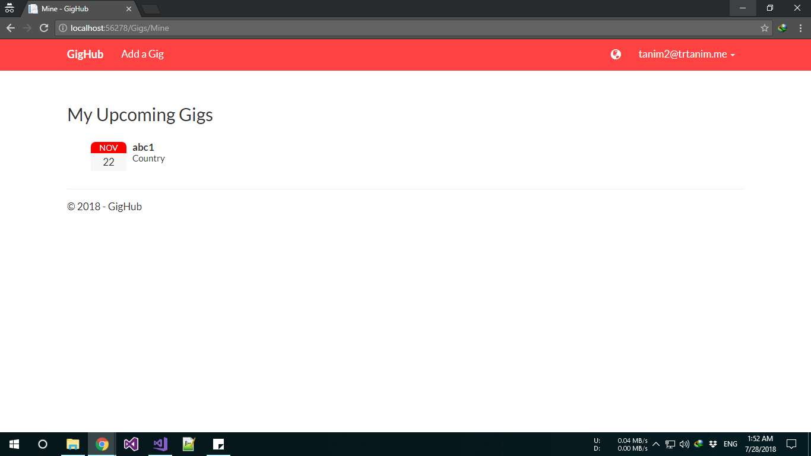
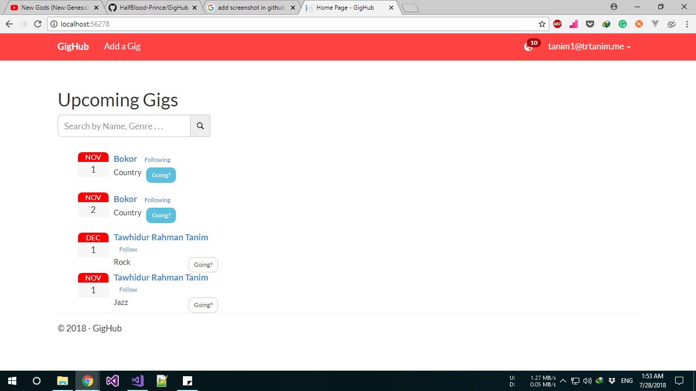

# GigHub

GigHub is a mini social network site. Here artist can post their
gigs or events to update their fans. Fans can follow artist, add gig to 
their calendar. If a gig is cancelled or updated fans will get push
notifications instantly.

